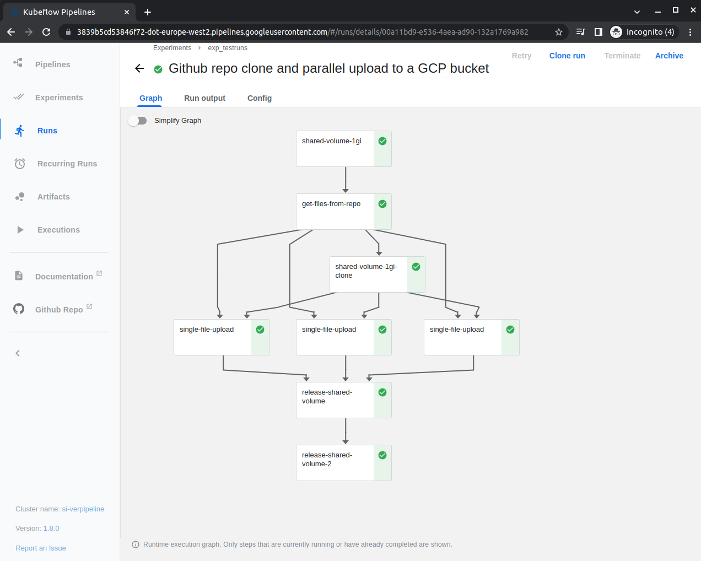

# Minimal Kubeflow Pipeline Template
## Deliverables
A Kubeflow pipeline that clones a dummy github repo, process its files (in this case, a simple copy) in parallel on separate Kubernetes nodes and collects their output on a single location on a cloud platform.

## Google Cloud Platform based solution
1. Make a [free GCP account](https://youtu.be/P2ADJdk5mYo) and project.
2. Install [gcloud CLI](https://cloud.google.com/sdk/docs/install); configure it for the project and enable Compute Engine API, Cloud Deployment Manager.
3. Create a service account for Kubernetes Engine Admin; generate and save auth key in console UI or with cli:
    ```gcloud projects add-iam-policy-binding ${KF_PROJECT} --member=${TYPE}:${EMAIL} --role=roles/{iap.httpsResourceAccessor,container.clusterViewer,viewer} --condition=None```
4. Create a cluster with appropriate [OAuth scope](https://cloud.google.com/compute/docs/access/service-accounts#accesscopesiam) (check [machine types](https://cloud.google.com/compute/docs/general-purpose-machines) to avoid unnecessary billing).
    ```gcloud container clusters create test_pipeline --zone europe-west4-c --machine-type e2-standard-2 --scopes cloud-platform```
5. Create nodepool for the cluster.
    ```gcloud container node-pools update default-pool --cluster test_pipeline --min-nodes 0 --num-nodes 0 --max-nodes 4 --enable-autoscaling --preemptible```
6. Install [kubectl](https://kubernetes.io/docs/tasks/tools/install-kubectl-linux/) and configure it to talk to GC ([doc](https://cloud.google.com/kubernetes-engine/docs/how-to/cluster-access-for-kubectl#apt_1))
7. Deploy kubeflow pipelines ([doc](https://www.kubeflow.org/docs/components/pipelines/installation/standalone-deployment/))
8. Create a storage bucket, add permissions for service account as both Storage Bucket and Objects Owner.
9. Create a docker image with appropriate gcloud config and ssh keys (refer to [Dockerfile](Dockerfile), *replace project name inside*).
10. Install KF pipelines SDK ([doc](https://www.kubeflow.org/docs/components/pipelines/sdk/install-sdk/)).
11. Write a [Kubeflow pipeline](kf_pipeline.py) to do the following:
    - Create a persistent volume (PVC) to be shared between subsequent jobs.
    - Create shared memory space.
    - On a single container:
        - Get a list of all files in the github repo as this container output.
        - Spawn as many nodes as the files in the repo and copy the files from PVC to a cloud bucket in parallel.
 - Release the PVC.
12. Compile the above pipeline with KF DSL compiler into a yaml.
13. Upload the compiled pipeline.yaml to KF pipelines dashboard and run an experiment.
    
